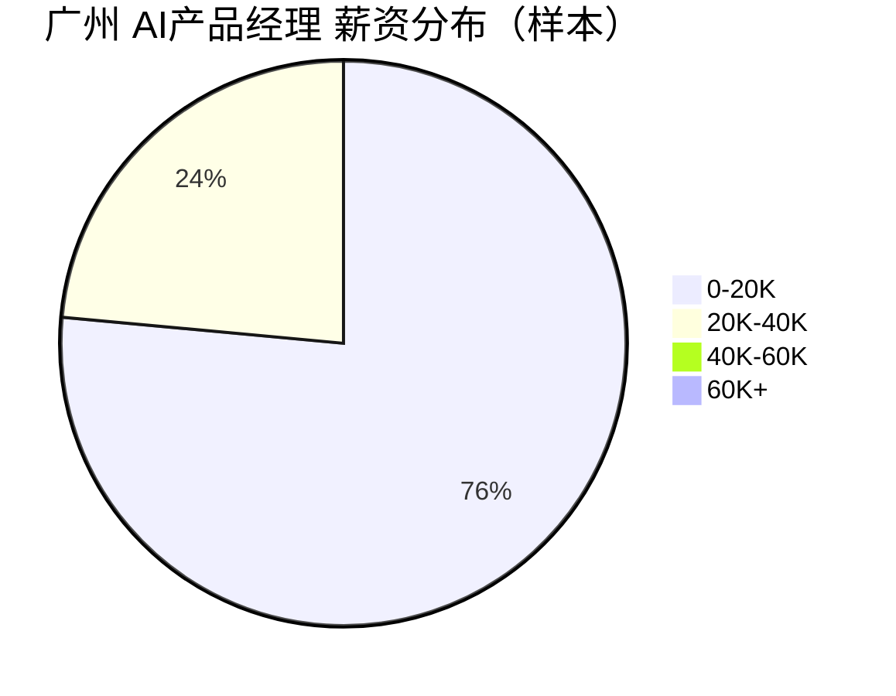

# 广州 AI产品经理 招聘市场报告（{{report_date}}）

  

> 聚焦广州 AI产品经理 相关岗位，以下为本周市场快照与最新岗位清单。

## 市场仪表盘

| 指标 | 数值 | 解读 |
|---|---:|---|
| 岗位总数 | **309** | 市场需求持续活跃 |
| 薪资中位数（K/月） | **15.0** | 主要集中在中高区间 |
| 查询范围 | `keyword=AI产品经理+广州` | 固定口径，便于横向对比 |
| 城市 | `广州` | 单城聚焦 |

### 薪资热力条

- `0-20K`  : ██████████████████████████████████████ 13
- `20K-40K` : ████████████ 4
- `40K-60K` : 0
- `60K+`    : 0

### 薪资分布图

## Top 10 最新岗位（最新优先）

| Rank | 公司 | 岗位 | 薪资 | 发布时间 |
|---:|---|---|---|---|
| 1 | 智慧引擎人才科技（江苏）有限公司 | AI软件销售 双休 五险一金 移动办公 | 10.0K-20.0K | 2026-03-20T18:42:41 |
| 2 | 广东省出版集团数字出版有限公司 | AI产品经理 | 10.83K-15.0K | 2026-03-20T15:33:51 |
| 3 | 广州市宏益供应链有限公司 | 数字产品经理 | 12.0K-20.0K | 2026-03-19T15:10:27 |
| 4 | 广东华智科技有限公司 | AI应用开发工程师 | 15.0K-30.0K | 2026-03-19T10:37:58 |
| 5 | 广州市番禺致丰微电器有限公司 | AI应用工程师 | 12.0K-18.0K | 2026-03-19T10:37:56 |
| 6 | 广州立白企业集团有限公司 | 营销系统（B端）产品经理(J13447) | 15.0K-20.0K | 2026-03-18T17:06:39 |
| 7 | 利民（番禺南沙）电器发展有限公司 | AI工程师 | 10.0K-12.0K | 2026-03-18T16:52:59 |
| 8 | 广州凡拓数字创意科技股份有限公司 | 客户经理（AI展馆+具身智能方向） | 10.0K-15.0K | 2026-03-18T14:59:15 |
| 9 | 广州维高集团有限公司 | AI 应用工程师 | 9.0K-12.0K | 2026-03-17T19:51:35 |
| 10 | 迈威科技（广州）有限公司 | 售前顾问（AIOPS） | 15.0K-20.0K | 2026-03-17T15:43:55 |

## 岗位详情卡（可折叠）

<strong>#1 智慧引擎人才科技（江苏）有限公司 - AI软件销售 双休 五险一金 移动办公（广州，10.0K-20.0K）</strong>

- 发布时间：2026-03-20T18:42:41
- 经验要求：1年及以上
- 学历要求：大专
- JD摘要：作为AI产品与理念的传播者，你将负责产品的区域客户拉新，推动产品在组织协同、办公提效等场景中的落地应用。通过场景化解决方案助力千行百业实现智能化升级。 【岗位职责】：推广免费的产品比如：产品app入驻

<strong>#2 广东省出版集团数字出版有限公司 - AI产品经理（广州，10.83K-15.0K）</strong>

- 发布时间：2026-03-20T15:33:51
- 经验要求：2年及以上
- 学历要求：本科
- JD摘要：岗位职责： 1、负责AI相关产品（如大模型应用、智能推荐系统、AIGC工具等）的需求调研、竞品分析，结合业务目标制定产品规划与路线图。主导产品从0到1或迭代优化的全生命周期管理，输出产品需求文档、原型

<strong>#3 广州市宏益供应链有限公司 - 数字产品经理（广州，12.0K-20.0K）</strong>

- 发布时间：2026-03-19T15:10:27
- 经验要求：1-3年
- 学历要求：本科
- JD摘要：岗位职责： 1.承接公司数字化战略，梳理业务、采购、财务等全部门岗位痛点，制定CRM系统线上化→数据化→智能化分阶段规划，对接各部门需求并输出解决方案。 2.主导CRM系统延伸，推动各部门核心环节线上

<strong>#4 广东华智科技有限公司 - AI应用开发工程师（广州，15.0K-30.0K）</strong>

- 发布时间：2026-03-19T10:37:58
- 经验要求：2年及以上
- 学历要求：大专
- JD摘要：岗位职责： 1、负责 AI 应用产品的需求分析、架构设计、功能开发与迭代，包括 AI 接口封装、业务逻辑实现、前端 / 后端联调。 2、对接多种大模型 API，完成prompt 工程、对话流程、工具调

<strong>#5 广州市番禺致丰微电器有限公司 - AI应用工程师（广州，12.0K-18.0K）</strong>

- 发布时间：2026-03-19T10:37:56
- 经验要求：4年及以上
- 学历要求：本科
- JD摘要：【岗位职责】 1.AI驱动的数据治理：利用LLM自动化清洗、结构化海量异构数据（合同/日志/新闻/ERP记录），解决传统ETL难题。 2.智能分析与建议生成：融合运筹算法与大模型推理（RAG），输出带

<strong>#6 广州立白企业集团有限公司 - 营销系统（B端）产品经理(J13447)（广州，15.0K-20.0K）</strong>

- 发布时间：2026-03-18T17:06:39
- 经验要求：5年及以上
- 学历要求：本科
- JD摘要：工作职责: 1、负责公司从品牌端到经销商的营销系统产品设计与实施，覆盖渠道管理、促销管理、进销存等前后端产品，并能主导AI驱动的产品模块建设，将AI能力赋能到实际业务场景中； 2、深度对接业务团队，开

<strong>#7 利民（番禺南沙）电器发展有限公司 - AI工程师（广州，10.0K-12.0K）</strong>

- 发布时间：2026-03-18T16:52:59
- 经验要求：1-3年
- 学历要求：本科
- JD摘要：【工作内容】 - 参与人工智能算法的设计、开发与优化，推动技术在实际业务场景中的应用； - 负责机器学习模型的训练、调优及部署，提升系统智能化水平； - 与产品、研发团队协作，完成从需求分析到落地的全

<strong>#8 广州凡拓数字创意科技股份有限公司 - 客户经理（AI展馆+具身智能方向）（广州，10.0K-15.0K）</strong>

- 发布时间：2026-03-18T14:59:15
- 经验要求：3年及以上
- 学历要求：本科
- JD摘要：工作职责： 1.负责AI展馆+未来工厂+具身智能（机器人）一体化解决方案在目标行业的市场推广与销售，完成业绩目标；面对政府、智能制造企业打造AI品牌体验馆、具身智能会客厅、未来工厂（智能制造管理）、具

<strong>#9 广州维高集团有限公司 - AI 应用工程师（广州，9.0K-12.0K）</strong>

- 发布时间：2026-03-17T19:51:35
- 经验要求：3年及以上
- 学历要求：大专
- JD摘要：岗位职责 1、基于大模型（GPT、通义、文心、豆包等）做API 调用、业务集成。 2、开发 AI 应用：智能问答、知识库、AI 客服、内容生成、数据分析、Agent 流程。 3、做Prompt 工程、

<strong>#10 迈威科技（广州）有限公司 - 售前顾问（AIOPS）（广州，15.0K-20.0K）</strong>

- 发布时间：2026-03-17T15:43:55
- 经验要求：5年及以上
- 学历要求：本科
- JD摘要：岗位职责： 1. 面向政企及企业大客户提供企业级IT运维相关的售前技术支持与解决方案。 2. 配合公司产品部门进行 AIOps（智能运维）产品的开发与推广计划，输出具备竞争力的智能运维解决方案。 3.

