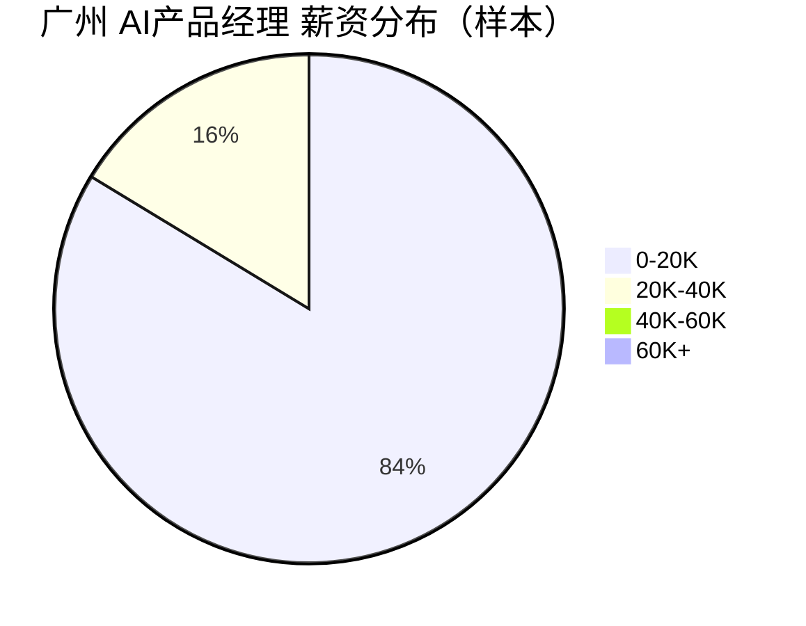

# 广州 AI产品经理 招聘市场报告（2026年3月22日）

## 市场仪表盘

| 指标 | 数值 |
|---|---:|
| 岗位总数（样本） | **200** |
| 薪资中位数（K/月） | **10.0** |
| 查询范围 | `keyword=AI产品经理+广州, city=广州` |

### 薪资热力条

- `0-20K` : ██████████████████████████████ 159
- `20K-40K` : █████ 31
- `40K-60K` : 0
- `60K+` : 0

### 薪资分布图

## Top 10 最新岗位（最新优先）

| Rank | 公司 | 岗位 | 薪资 | 发布时间 |
|---:|---|---|---|---|
| 1 | 鑫立德（湖北）机电设备工程 | AI数据工程师 | 8千-1.3万 | 2026-03-22 15:13:17 |
| 2 | 美团 | AI Agent产品运营实习生 | 4-5千 | 2026-03-22 09:24:18 |
| 3 | 美团 | AI方向后端开发工程师（实习） | 6-8千 | 2026-03-22 09:23:55 |
| 4 | 美团 | 美团平台数据产品实习生 | 3-5千 | 2026-03-22 09:23:53 |
| 5 | 贵州壹集科技 | 数据采集 | 3-4千 | 2026-03-22 04:08:14 |
| 6 | 合肥新空项目管理 | 兼/职项目文员，160元/天日/接 | 3-4.5千 | 2026-03-22 04:05:46 |
| 7 | 字节跳动 | AI产品实习生-豆包爱学 | 9千-1万 | 2026-03-22 02:07:11 |
| 8 | 字节跳动 | 技术产品实习生（算法协作方向）-中国交易与广告 | 6千-1万 | 2026-03-22 02:06:52 |
| 9 | 字节跳动 | AI产品实习生-Data AML | 5-7千 | 2026-03-22 01:58:57 |
| 10 | 长沙诺君科技 | AI动态漫助理 | 6-8千 | 2026-03-22 00:38:17 |

## 🤖 AI深度分析（MCP增强）

- 高频技能 Top5: 无
- AI相关岗位占比: 0.0%
- 常见工具 Top3: 无
