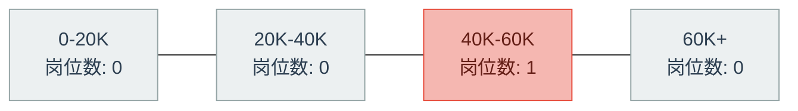
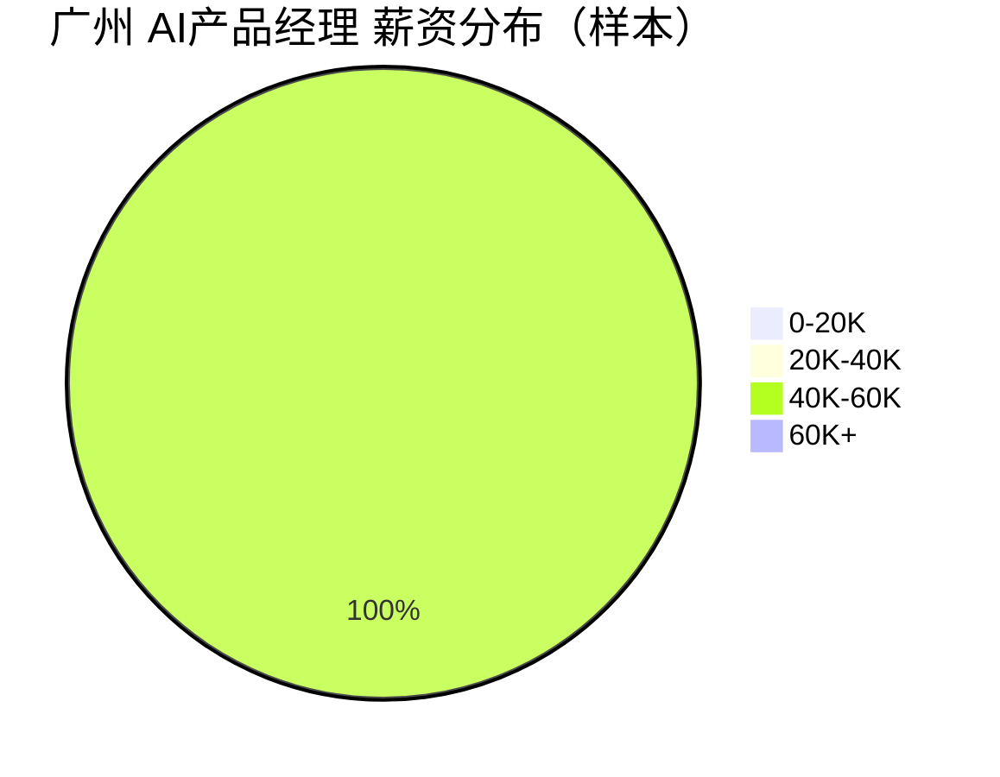

# 广州 AI产品经理 招聘市场报告（2026年3月22日）

## 市场仪表盘

| 指标 | 数值 |
|---|---:|
| 查询条件 | Top50活跃职位 |
| 薪资中位数（K/月） | **45.0** |
| 查询范围 | `keyword=AI产品经理+广州, city=广州` |

### 薪资热力条

### 薪资分布图

## Top 15 最新岗位

<strong>#1 广州睿健邦科技 - ai产品技术总监（广州·黄埔区，4-5万）</strong>

- 岗位：[ai产品技术总监](https://jobs.51job.com/guangzhou-hpq/171189686.html?s=sou_sou_soulb&t=0_0&req=83da63ae99125a8bc2aed79755482268)
- 公司：广州睿健邦科技
- 城市：广州·黄埔区
- 薪资：4-5万
- 发布时间：2026-03-21 17:56:53

## 🤖 AI深度分析（MCP增强）

- 高频技能 Top5: 无
- AI相关岗位占比: 0.0%
- 常见工具 Top3: 无
