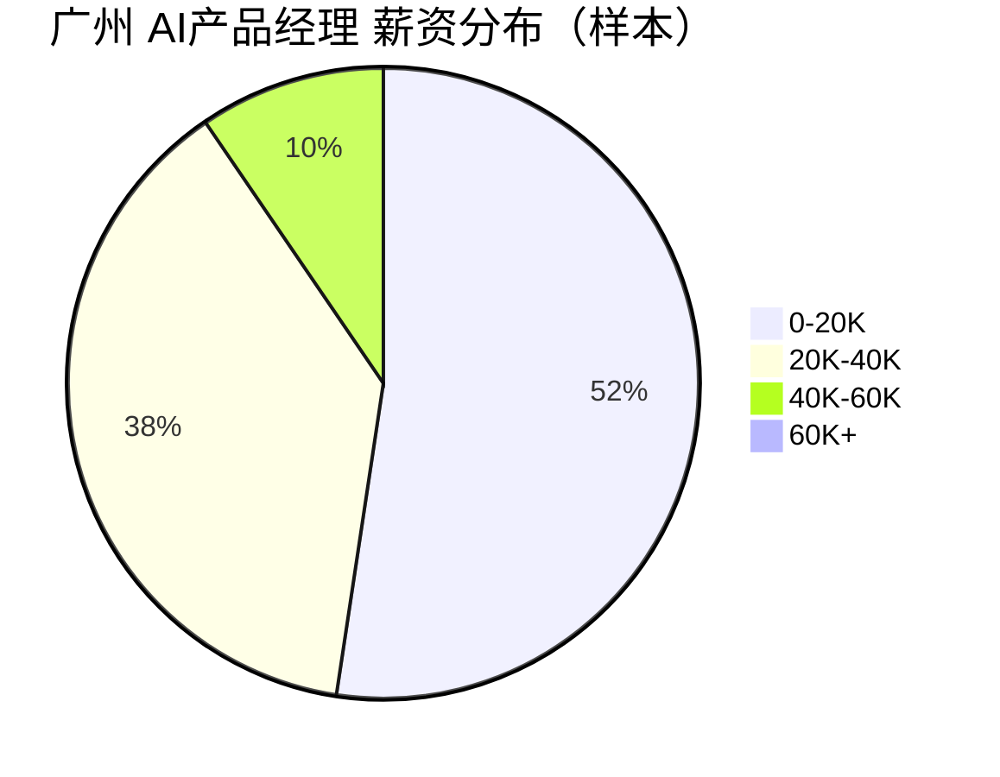

# 广州 AI产品经理 招聘市场报告（2026年3月22日）

## 市场仪表盘

| 指标 | 数值 |
|---|---:|
| 查询条件 | Top50活跃职位 |
| 薪资中位数（K/月） | **19.34** |
| 查询范围 | `keyword=AI产品经理+广州, city=广州` |

### 薪资热力条

- `0-20K` : ██████████████████████████████ 22
- `20K-40K` : █████████████████████ 16
- `40K-60K` : █████ 4
- `60K+` : 0

### 薪资分布图

## Top 15 最新岗位

<strong>#1 广州睿健邦科技 - ai产品技术总监（广州·黄埔区，4-5万）</strong>

- 岗位：[ai产品技术总监](https://jobs.51job.com/guangzhou-hpq/171189686.html?s=sou_sou_soulb&t=0_0&req=83da63ae99125a8bc2aed79755482268)
- 公司：广州睿健邦科技
- 城市：广州·黄埔区
- 薪资：4-5万
- 发布时间：2026-03-21 17:56:53

<strong>#2 广州青鹿教育科技 - 产品经理（广州·黄埔区，1.5-2万）</strong>

- 岗位：[产品经理](https://jobs.51job.com/guangzhou-hpq/171188975.html?s=sou_sou_soulb&t=0_0&req=83da63ae99125a8bc2aed79755482268)
- 公司：广州青鹿教育科技
- 城市：广州·黄埔区
- 薪资：1.5-2万
- 发布时间：2026-03-21 16:33:46

<strong>#3 广州联冠投资 - 国际教育平台产品经理（广州·黄埔区，1.6-2.3万）</strong>

- 岗位：[国际教育平台产品经理](https://jobs.51job.com/guangzhou-hpq/170977521.html?s=sou_sou_soulb&t=0_0&req=bf12ea04c4198520696cb34ac9fc3c35)
- 公司：广州联冠投资
- 城市：广州·黄埔区
- 薪资：1.6-2.3万
- 发布时间：2026-03-20 17:40:14

<strong>#4 中国电子产品可靠性与环境试验研究所（（工业和信息化部电子第五研究所）（中国赛宝实验室）） - AI具身智能产品工程师（广州·增城区，21-25万/年）</strong>

- 岗位：[AI具身智能产品工程师](https://jobs.51job.com/guangzhou-zcq/171180963.html?s=sou_sou_soulb&t=0_0&req=83da63ae99125a8bc2aed79755482268)
- 公司：中国电子产品可靠性与环境试验研究所（（工业和信息化部电子第五研究所）（中国赛宝实验室））
- 城市：广州·增城区
- 薪资：21-25万/年
- 发布时间：2026-03-20 17:22:41

<strong>#5 广州广哈通信 - 通信产品经理/产品工程师（广州·黄埔区，1.5-2.5万·13薪）</strong>

- 岗位：[通信产品经理/产品工程师](https://jobs.51job.com/guangzhou-hpq/157156006.html?s=sou_sou_soulb&t=0_0&req=6d25a2ea26eb494e4bb54dcf070f4f24)
- 公司：广州广哈通信
- 城市：广州·黄埔区
- 薪资：1.5-2.5万·13薪
- 发布时间：2026-03-20 15:58:27

<strong>#6 深圳市南电云商 - 产品策划经理（广州·天河区，8千-1.6万）</strong>

- 岗位：[产品策划经理](https://jobs.51job.com/guangzhou-thq/171176518.html?s=sou_sou_soulb&t=0_0&req=83da63ae99125a8bc2aed79755482268)
- 公司：深圳市南电云商
- 城市：广州·天河区
- 薪资：8千-1.6万
- 发布时间：2026-03-20 15:42:07

<strong>#7 广东省出版集团数字出版 - 产品经理（广州·天河区，20-30万/年）</strong>

- 岗位：[产品经理](https://jobs.51job.com/guangzhou-thq/171127404.html?s=sou_sou_soulb&t=0_0&req=a469e4abaf3bae5b1aa33c9bc6cb8627)
- 公司：广东省出版集团数字出版
- 城市：广州·天河区
- 薪资：20-30万/年
- 发布时间：2026-03-20 15:33:51

<strong>#8 广州微框科技 - 产品助理（广州·黄埔区，4-8千）</strong>

- 岗位：[产品助理](https://jobs.51job.com/guangzhou-hpq/171171569.html?s=sou_sou_soulb&t=0_0&req=83da63ae99125a8bc2aed79755482268)
- 公司：广州微框科技
- 城市：广州·黄埔区
- 薪资：4-8千
- 发布时间：2026-03-20 13:34:11

<strong>#9 前锦网络信息技术（上海） - 大数据项目管理（广州·天河区，1.8-2.4万）</strong>

- 岗位：[大数据项目管理](https://jobs.51job.com/guangzhou-thq/170399996.html?s=sou_sou_soulb&t=0_0&req=83da63ae99125a8bc2aed79755482268)
- 公司：前锦网络信息技术（上海）
- 城市：广州·天河区
- 薪资：1.8-2.4万
- 发布时间：2026-03-20 10:40:04

<strong>#10 广州市宏益供应链 - 数字产品经理（广州·增城区，1.2-2万）</strong>

- 岗位：[数字产品经理](https://jobs.51job.com/guangzhou-zcq/170484291.html?s=sou_sou_soulb&t=0_0&req=83da63ae99125a8bc2aed79755482268)
- 公司：广州市宏益供应链
- 城市：广州·增城区
- 薪资：1.2-2万
- 发布时间：2026-03-19 15:10:27

<strong>#11 广东慧谷人力资源管理咨询 - 产品总监（广州·番禺区，3-4万）</strong>

- 岗位：[产品总监](https://jobs.51job.com/guangzhou-pyq/171148452.html?s=sou_sou_soulb&t=0_0&req=6d25a2ea26eb494e4bb54dcf070f4f24)
- 公司：广东慧谷人力资源管理咨询
- 城市：广州·番禺区
- 薪资：3-4万
- 发布时间：2026-03-19 14:25:32

<strong>#12 广州岭南集团控股 - 总部数字化管理中心高级产品经理（酒店业）（广州，1.8-2.8万）</strong>

- 岗位：[总部数字化管理中心高级产品经理（酒店业）](https://jobs.51job.com/guangzhou/171147624.html?s=sou_sou_soulb&t=0_0&req=83da63ae99125a8bc2aed79755482268)
- 公司：广州岭南集团控股
- 城市：广州
- 薪资：1.8-2.8万
- 发布时间：2026-03-19 14:07:07

<strong>#13 广州力赛计量检测 - 财务AI/数字化专员（广州，8千-1.5万）</strong>

- 岗位：[财务AI/数字化专员](https://jobs.51job.com/guangzhou/171124199.html?s=sou_sou_soulb&t=0_0&req=6d25a2ea26eb494e4bb54dcf070f4f24)
- 公司：广州力赛计量检测
- 城市：广州
- 薪资：8千-1.5万
- 发布时间：2026-03-19 14:07:07

<strong>#14 广东华智科技 - AI应用开发工程师（广州·黄埔区，1.5-3万）</strong>

- 岗位：[AI应用开发工程师](https://jobs.51job.com/guangzhou-hpq/170877695.html?s=sou_sou_soulb&t=0_0&req=83da63ae99125a8bc2aed79755482268)
- 公司：广东华智科技
- 城市：广州·黄埔区
- 薪资：1.5-3万
- 发布时间：2026-03-19 10:37:58

<strong>#15 广州杰纳医药科技发展 - 测试工程师（广州·黄埔区，8千-1.2万）</strong>

- 岗位：[测试工程师](https://jobs.51job.com/guangzhou-hpq/161295716.html?s=sou_sou_soulb&t=0_0&req=a469e4abaf3bae5b1aa33c9bc6cb8627)
- 公司：广州杰纳医药科技发展
- 城市：广州·黄埔区
- 薪资：8千-1.2万
- 发布时间：2026-03-19 09:47:24

## 🤖 AI深度分析（MCP增强）

- 高频技能 Top5: 无
- AI相关岗位占比: 20.0%
- 常见工具 Top3: 无
