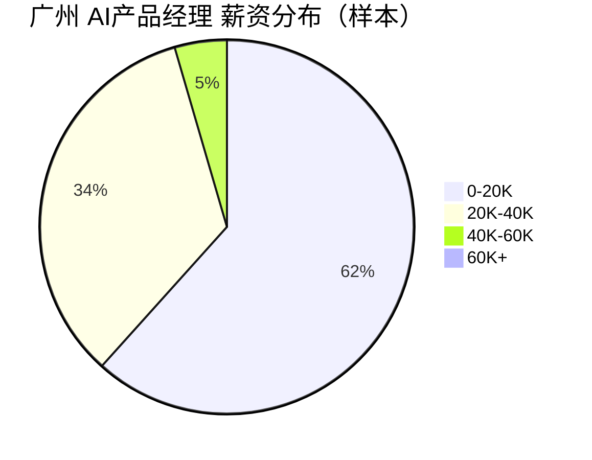

# 广州 AI产品经理 招聘市场报告（2026年3月27日）

## 市场仪表盘

| 指标 | 数值 |
|---|---:|
| 查询条件 | Top50活跃职位 |
| 薪资中位数（K/月） | **15.0** |
| 查询范围 | `keyword=AI产品经理+广州, city=广州` |

### 薪资热力条

- `0-20K` : ██████████████████████████████ 82
- `20K-40K` : ████████████████ 45
- `40K-60K` : ██ 6
- `60K+` : 0

### 薪资分布图

## Top 15 最新岗位

<strong>#1 广州骏伯人力资源 - 产品经理岗（广州·天河区，1.5-2.5万）</strong>

- 岗位：[产品经理岗](https://jobs.51job.com/guangzhou-thq/170689205.html?s=sou_sou_soulb&t=0_0&req=4ef495ed9793bc4cf4d68dd4d7e603e6)
- 公司：广州骏伯人力资源
- 城市：广州·天河区
- 薪资：1.5-2.5万
- 发布时间：2026-03-27 16:20:42

<strong>#2 纽勒智能科技（广州） - UI设计工程师（广州·南沙区，6.5千-1.2万·13薪）</strong>

- 岗位：[UI设计工程师](https://jobs.51job.com/guangzhou-nsq/170137143.html?s=sou_sou_soulb&t=0_0&req=22e36d87aaa91e62988f3a5f830f786a)
- 公司：纽勒智能科技（广州）
- 城市：广州·南沙区
- 薪资：6.5千-1.2万·13薪
- 发布时间：2026-03-27 13:30:00

<strong>#3 广州市迈尔汛科技 - ERP产品经理/实施顾问（广州·黄埔区，9千-1.8万）</strong>

- 岗位：[ERP产品经理/实施顾问](https://jobs.51job.com/guangzhou-hpq/153504046.html?s=sou_sou_soulb&t=0_0&req=5103719cfdba991e37df0751f7399c9a)
- 公司：广州市迈尔汛科技
- 城市：广州·黄埔区
- 薪资：9千-1.8万
- 发布时间：2026-03-27 11:32:10

<strong>#4 广东南芯医疗科技 - 电商渠道分销产品经理（广州·黄埔区，1-2万）</strong>

- 岗位：[电商渠道分销产品经理](https://jobs.51job.com/guangzhou-hpq/170520887.html?s=sou_sou_soulb&t=0_0&req=b19f623fede5220d08a2235535c01685)
- 公司：广东南芯医疗科技
- 城市：广州·黄埔区
- 薪资：1-2万
- 发布时间：2026-03-27 11:21:46

<strong>#5 广州国睿科学仪器 - AI智能工作流选品师（广州·白云区，1.2-1.8万）</strong>

- 岗位：[AI智能工作流选品师](https://jobs.51job.com/guangzhou-byq/170611109.html?s=sou_sou_soulb&t=0_0&req=b19f623fede5220d08a2235535c01685)
- 公司：广州国睿科学仪器
- 城市：广州·白云区
- 薪资：1.2-1.8万
- 发布时间：2026-03-27 10:44:06

<strong>#6 广州国睿科学仪器 - 亚马逊运营（要求985毕业-机器人行业）（广州·天河区，1.2-2万）</strong>

- 岗位：[亚马逊运营（要求985毕业-机器人行业）](https://jobs.51job.com/guangzhou-thq/170902634.html?s=sou_sou_soulb&t=0_0&req=27ee470b937ad494abb3144b4e2b41c2)
- 公司：广州国睿科学仪器
- 城市：广州·天河区
- 薪资：1.2-2万
- 发布时间：2026-03-27 10:44:05

<strong>#7 京华信息科技 - python开发（广州·天河区，1-2万）</strong>

- 岗位：[python开发](https://jobs.51job.com/guangzhou-thq/163248250.html?s=sou_sou_soulb&t=0_0&req=5103719cfdba991e37df0751f7399c9a)
- 公司：京华信息科技
- 城市：广州·天河区
- 薪资：1-2万
- 发布时间：2026-03-27 09:28:38

<strong>#8 日升餐厨科技（广东） - 产品经理（广州·番禺区，2-3万·13薪）</strong>

- 岗位：[产品经理](https://jobs.51job.com/guangzhou-pyq/167699702.html?s=sou_sou_soulb&t=0_0&req=5103719cfdba991e37df0751f7399c9a)
- 公司：日升餐厨科技（广东）
- 城市：广州·番禺区
- 薪资：2-3万·13薪
- 发布时间：2026-03-27 08:56:06

<strong>#9 广州九加一电子科技 - 产品经理（广州·白云区，2-3万）</strong>

- 岗位：[产品经理](https://jobs.51job.com/guangzhou-byq/167755765.html?s=sou_sou_soulb&t=0_0&req=186c7f96dda6753b5e035e513b69a666)
- 公司：广州九加一电子科技
- 城市：广州·白云区
- 薪资：2-3万
- 发布时间：2026-03-27 08:46:30

<strong>#10 广州象九数字传媒 - 人工智能训练师推广大使（广州，1-2万）</strong>

- 岗位：[人工智能训练师推广大使](https://jobs.51job.com/guangzhou/171265122.html?s=sou_sou_soulb&t=0_0&req=e8033eed6dd48be4e1cca94973c62b08)
- 公司：广州象九数字传媒
- 城市：广州
- 薪资：1-2万
- 发布时间：2026-03-27 04:06:22

<strong>#11 新讯数字科技（杭州） - 产品经理（沃音乐）（广州·天河区，1-1.5万）</strong>

- 岗位：[产品经理（沃音乐）](https://jobs.51job.com/guangzhou-thq/171286686.html?s=sou_sou_soulb&t=0_0&req=e8033eed6dd48be4e1cca94973c62b08)
- 公司：新讯数字科技（杭州）
- 城市：广州·天河区
- 薪资：1-1.5万
- 发布时间：2026-03-26 18:01:08

<strong>#12 广东慧谷人力资源管理咨询 - 产品总监（广州·番禺区，3-4万）</strong>

- 岗位：[产品总监](https://jobs.51job.com/guangzhou-pyq/171148452.html?s=sou_sou_soulb&t=0_0&req=3283f633829d8fd25b362ae7fce26eeb)
- 公司：广东慧谷人力资源管理咨询
- 城市：广州·番禺区
- 薪资：3-4万
- 发布时间：2026-03-26 17:46:04

<strong>#13 广东广信通信服务 - 产品经理（广州·天河区，1.4-1.6万）</strong>

- 岗位：[产品经理](https://jobs.51job.com/guangzhou-thq/171271934.html?s=sou_sou_soulb&t=0_0&req=e8033eed6dd48be4e1cca94973c62b08)
- 公司：广东广信通信服务
- 城市：广州·天河区
- 薪资：1.4-1.6万
- 发布时间：2026-03-26 10:52:40

<strong>#14 广州南翼信息科技 - 安卓开发工程师（广州，8千-1.2万）</strong>

- 岗位：[安卓开发工程师](https://jobs.51job.com/guangzhou/170950530.html?s=sou_sou_soulb&t=0_0&req=7f757c0bc20644bb4a48a34fe68ea97d)
- 公司：广州南翼信息科技
- 城市：广州
- 薪资：8千-1.2万
- 发布时间：2026-03-26 09:19:15

<strong>#15 广州市贤人汇国际贸易 - 化工专业销售顾问（广州·海珠区，6.5千-1.3万）</strong>

- 岗位：[化工专业销售顾问](https://jobs.51job.com/guangzhou-hzq/170882566.html?s=sou_sou_soulb&t=0_0&req=27ee470b937ad494abb3144b4e2b41c2)
- 公司：广州市贤人汇国际贸易
- 城市：广州·海珠区
- 薪资：6.5千-1.3万
- 发布时间：2026-03-26 09:06:31

## 🤖 AI深度分析（MCP增强）

- 高频技能 Top5: 无
- AI相关岗位占比: 20.0%
- 常见工具 Top3: 无
