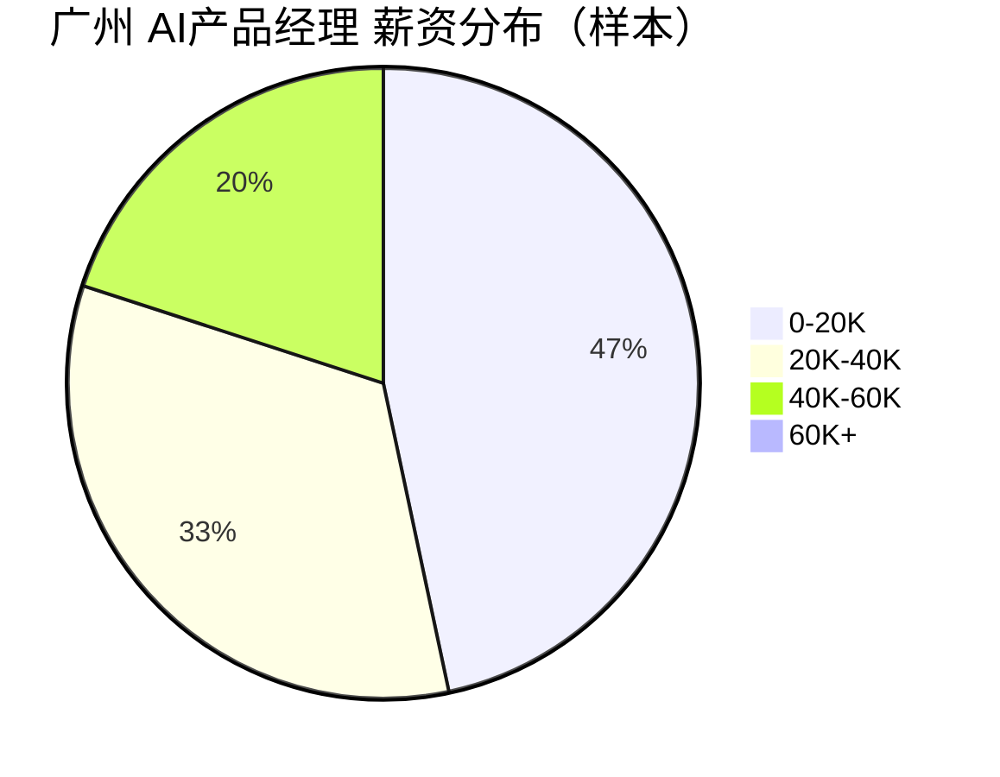

# 广州 AI产品经理 招聘市场报告（2026年3月28日）

## 市场仪表盘

| 指标 | 数值 |
|---|---:|
| 查询条件 | Top50活跃职位 |
| 薪资中位数（K/月） | **20.0** |
| 查询范围 | `keyword=AI产品经理+广州, city=广州` |

### 薪资热力条

- `0-20K` : ██████████████████████████████ 7
- `20K-40K` : █████████████████████ 5
- `40K-60K` : ████████████ 3
- `60K+` : 0

### 薪资分布图

## Top 15 最新岗位

<strong>#1 广州市派客朴食信息科技 - AI产品经理（广州·海珠区，1.8-2.5万）</strong>

- 岗位：[AI产品经理](https://jobs.51job.com/guangzhou-hzq/171262863.html?s=sou_sou_soulb&t=0_0&req=8cd97d5642d2279caaef309d7d1dcd72)
- 公司：广州市派客朴食信息科技
- 城市：广州·海珠区
- 薪资：1.8-2.5万
- 发布时间：2026-03-25 17:30:35

<strong>#2 普望（上海）信息科技 - AI产品经理（广州，1.8-2.5万）</strong>

- 岗位：[AI产品经理](https://jobs.51job.com/guangzhou/171255716.html?s=sou_sou_soulb&t=0_0&req=8cd97d5642d2279caaef309d7d1dcd72)
- 公司：普望（上海）信息科技
- 城市：广州
- 薪资：1.8-2.5万
- 发布时间：2026-03-25 14:53:18

<strong>#3 广东省建筑科学研究院集团 - AI产品经理（广州·天河区，1.5-2.5万）</strong>

- 岗位：[AI产品经理](https://jobs.51job.com/guangzhou-thq/168841366.html?s=sou_sou_soulb&t=0_0&req=f1f1a38286b637d3efae0b4c416c3e9b)
- 公司：广东省建筑科学研究院集团
- 城市：广州·天河区
- 薪资：1.5-2.5万
- 发布时间：2026-03-23 15:51:28

<strong>#4 广东健力宝 - ai产品经理（广州·番禺区，1-1.5万·13薪）</strong>

- 岗位：[ai产品经理](https://jobs.51job.com/guangzhou-pyq/171200228.html?s=sou_sou_soulb&t=0_0&req=8cd97d5642d2279caaef309d7d1dcd72)
- 公司：广东健力宝
- 城市：广州·番禺区
- 薪资：1-1.5万·13薪
- 发布时间：2026-03-23 11:53:24

<strong>#5 广东省出版集团数字出版 - AI产品经理（广州·天河区，13-18万/年）</strong>

- 岗位：[AI产品经理](https://jobs.51job.com/guangzhou-thq/171128219.html?s=sou_sou_soulb&t=0_0&req=9acde0936dda49685d6f2b15245ea885)
- 公司：广东省出版集团数字出版
- 城市：广州·天河区
- 薪资：13-18万/年
- 发布时间：2026-03-20 15:33:51

<strong>#6 凯通科技 - AI产品经理（广州）（广州·黄埔区，1.8-3万）</strong>

- 岗位：[AI产品经理（广州）](https://jobs.51job.com/guangzhou-hpq/171098522.html?s=sou_sou_soulb&t=0_0&req=8cd97d5642d2279caaef309d7d1dcd72)
- 公司：凯通科技
- 城市：广州·黄埔区
- 薪资：1.8-3万
- 发布时间：2026-03-17 15:16:40

<strong>#7 广州凡拓数字创意科技 - AI产品经理（具身机器人方向优先）（广州·天河区，5-6万·16薪）</strong>

- 岗位：[AI产品经理（具身机器人方向优先）](https://jobs.51job.com/guangzhou-thq/169262602.html?s=sou_sou_soulb&t=0_0&req=c135dcf5023b2a7844be263a5359d49d)
- 公司：广州凡拓数字创意科技
- 城市：广州·天河区
- 薪资：5-6万·16薪
- 发布时间：2026-03-17 10:53:54

<strong>#8 广东超腾信息科技 - AI产品经理（外呼方向）自研（广州·天河区，1-1.5万）</strong>

- 岗位：[AI产品经理（外呼方向）自研](https://jobs.51job.com/guangzhou-thq/170988985.html?s=sou_sou_soulb&t=0_0&req=c135dcf5023b2a7844be263a5359d49d)
- 公司：广东超腾信息科技
- 城市：广州·天河区
- 薪资：1-1.5万
- 发布时间：2026-03-11 14:39:57

<strong>#9 广东超腾信息科技 - AI产品经理（智能音箱方向）双休（广州·天河区，1-1.5万）</strong>

- 岗位：[AI产品经理（智能音箱方向）双休](https://jobs.51job.com/guangzhou-thq/170970399.html?s=sou_sou_soulb&t=0_0&req=c6e3244e7f4202d3e369aae8cab8769d)
- 公司：广东超腾信息科技
- 城市：广州·天河区
- 薪资：1-1.5万
- 发布时间：2026-03-10 17:56:41

<strong>#10 广州海颐软件 - AI产品经理-yfzx（广州·黄埔区，1.5-2.5万）</strong>

- 岗位：[AI产品经理-yfzx](https://jobs.51job.com/guangzhou-hpq/168794145.html?s=sou_sou_soulb&t=0_0&req=ce36614eb3eb441b98624e490731bf4b)
- 公司：广州海颐软件
- 城市：广州·黄埔区
- 薪资：1.5-2.5万
- 发布时间：2026-02-27 14:12:22

<strong>#11 广州宏健智能信息工程 - 医疗AI产品经理（影像AI/医技AI｜医院ToB）（广州·黄埔区，3-5万）</strong>

- 岗位：[医疗AI产品经理（影像AI/医技AI｜医院ToB）](https://jobs.51job.com/guangzhou-hpq/170655998.html?s=sou_sou_soulb&t=0_0&req=f1f1a38286b637d3efae0b4c416c3e9b)
- 公司：广州宏健智能信息工程
- 城市：广州·黄埔区
- 薪资：3-5万
- 发布时间：2026-02-25 11:01:33

<strong>#12 上海以稀文化传播 - AI产品经理（广州·白云区，1.2-1.6万）</strong>

- 岗位：[AI产品经理](https://jobs.51job.com/guangzhou-byq/170309976.html?s=sou_sou_soulb&t=0_0&req=8af509f19213b3c834b5cde02e4290c6)
- 公司：上海以稀文化传播
- 城市：广州·白云区
- 薪资：1.2-1.6万
- 发布时间：2026-01-16 20:45:44

<strong>#13 广州创美药业 - AI产品经理（广州·南沙区，1-1.5万）</strong>

- 岗位：[AI产品经理](https://jobs.51job.com/guangzhou-nsq/170091544.html?s=sou_sou_soulb&t=0_0&req=570fc78f697c9f82ace70f638f6158bd)
- 公司：广州创美药业
- 城市：广州·南沙区
- 薪资：1-1.5万
- 发布时间：2026-01-04 10:44:51

<strong>#14 广州广日 - AI产品经理（广州·海珠区，1.2-2万·14薪）</strong>

- 岗位：[AI产品经理](https://jobs.51job.com/guangzhou-hzq/169908874.html?s=sou_sou_soulb&t=0_0&req=570fc78f697c9f82ace70f638f6158bd)
- 公司：广州广日
- 城市：广州·海珠区
- 薪资：1.2-2万·14薪
- 发布时间：2025-12-19 16:27:04

<strong>#15 广州长嘉电子 - ai产品经理（广州·南沙区，3-5万·14薪）</strong>

- 岗位：[ai产品经理](https://jobs.51job.com/guangzhou-nsq/169625066.html?s=sou_sou_soulb&t=0_0&req=05b395fb001a136e36e5cc2126046b6c)
- 公司：广州长嘉电子
- 城市：广州·南沙区
- 薪资：3-5万·14薪
- 发布时间：2025-12-03 11:27:36

## 🤖 AI深度分析（MCP增强）

- 高频技能 Top5: 无
- AI相关岗位占比: 0.0%
- 常见工具 Top3: 无
